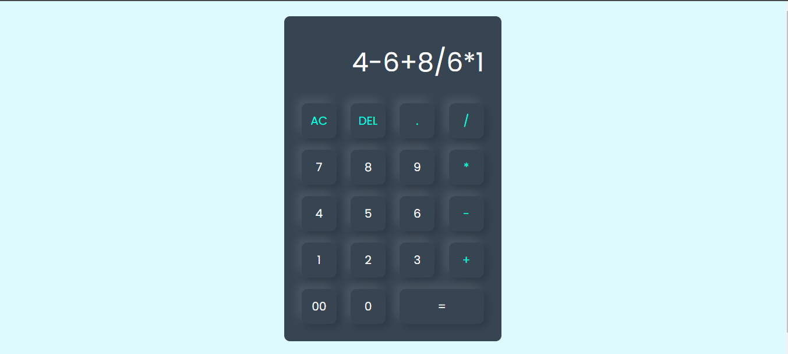
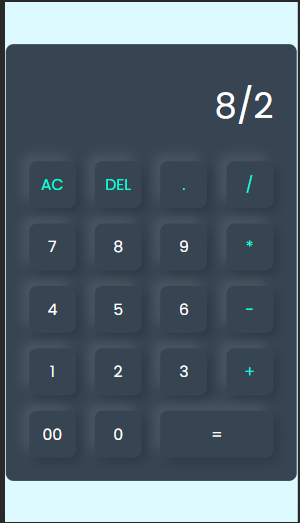

## Web View

## Mobile View

# Getting Started with Calculater App

<a href="https://huzaifanizam.github.io/Complete-Calculator/" target="blank">It is a simple calculater Where you 
add subtract divide and multiply </a>

- 📫 How to reach me **nizamhuzaifa@gmail.com**

<h3 align="left">Connect with me:</h3>

